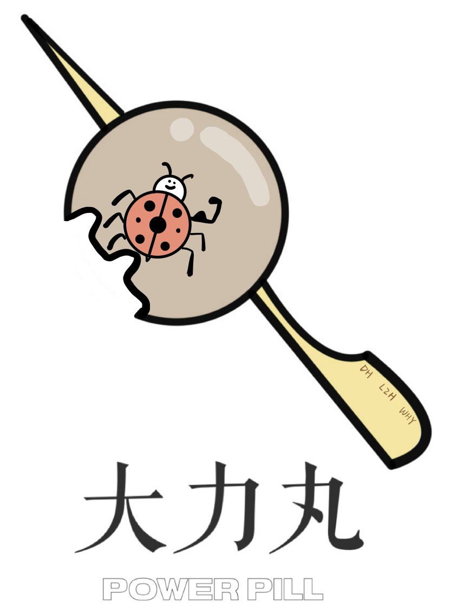

# 
Power-Pill

This is a project which we do Covid-19 data collection and analysis according to the information from [a website]([See the latest data in your region - Johns Hopkins Coronavirus Resource Center (jhu.edu)](https://coronavirus.jhu.edu/region)). The whole project is divided into three tasks, and detailed information will be shown below.

Our repository contains:

* Check: It's the most important part. There store our ordered final achievements of three tasks.
* Main: All of our codes, whether it's useful or not, are in this file, which may seems a little messy.
* Record: This file records our plans and notes. It's a record of our learning process.
* .DS_Store: It's a file that you can ignore it.
* .gitignore: It's a file can be ignored too, as its name.

## Table of Contents

- [Task 1](#task 1)
  * Introduction
  * What we learn in the task
  * What we do in the task
  * What we get in the task

- [Task 2](#task 2)
  * Introduction
  * What we learn in the task
  * What we do in the task
  * What we get in the task

- [Task 3](#task 3)
  * Introduction
  * What we learn in the task
  * What we do in the task
  * What we get in the task

- [Contributing](#contributing)

## **Task 1**

### Introduction:

In this task, we collect information about Covid-19 in American 52 states from a specific website, which is mentioned above, with a python crawler. 

### What we learn in the task:

1. We learn how a website work, and according to which can we know the basic concept of crawling, and the basic way to crawl the data.
2. We learn to use two new python libraries, requests and json. We can simulate the operation of browser with library requests, so we may send a request to get data from web server and process the data in python with library json. Also, we learn further by coding the whole process of crawling into a function, which simplify the crawling greatly.

### What we do in the task:

1. We collect infection, hospitalization and vaccination information in American52 states using the *state_name.json* provided, not hard coding.
2. We dispose the output using the library panda and we also learn to integrate all of the 52 tables into one, representing like a "3D chart", which enables us to analyze it more easily in the following tasks.

### What we get in the task；

We finally get a file storing all the data crawled from the website in the form of a 3D chart.

## **Task 2**

### Introduction:

### What we learn in the task:

### What we do in the task:

### What we get in the task；

## **Task 3**

### Introduction:

### What we learn in the task:

### What we do in the task:

### What we get in the task；

## Contributing

This project exists thanks to all the people who contributes

PROJECT MEMBER: [@PlaneTraveller](https://github.com/PlaneTraveller); [@DDaname](https://github.com/DDaname); [@Mogranie](https://github.com/Mogranie)

ADVISOR: @QLT;@ZCF
